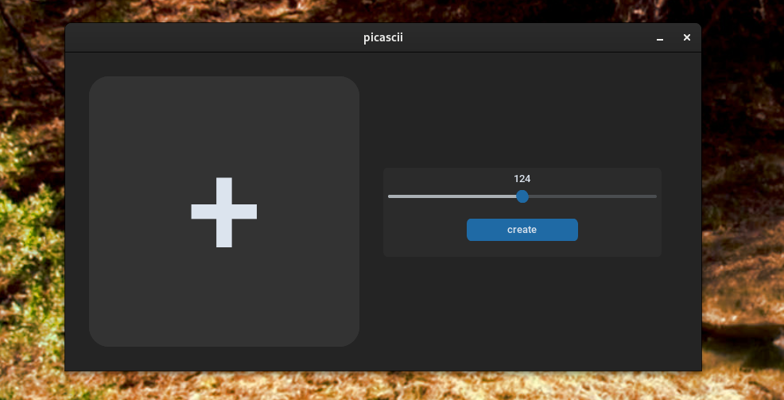

<h1>
<div style="display:flex; align-items:center;">

<div style="text-align:right;">
picascii
</div>
</div>
</h1>
A simple graphical user interface (GUI) tool to convert images into ASCII art using Python. The tool allows you to select an image from your local machine and create the converted ASCII art. It also provides options to adjust the resolution of the ASCII image.

## Features

- Convert images to ASCII art
- Adjust resolution
- Save the ASCII art as a text file

## Preview

Here is a preview of the GUI:



## How to Use

1. Ensure you have Python installed on your machine. If not, download and install it from the official Python website.
2. Clone this repository to your local machine or simply download the ZIP file.
3. Open a terminal or command prompt and navigate to the project directory.
4. Install the required dependencies by running the following command:
```shell
pip install -r requirements.txt
```
5. Run the `main.py` file with Python:
```shell
python main.py
```
6. The GUI window will appear. Use the + button to select an image from your local machine.
7. Adjust the desired resolution using the slider.
8. Click on the create button to create the ASCII art.

## Technologies Used

- Python
- Tkinter (Python GUI library)
- customtkinter

## License

This project is licensed under the MIT License. See the [LICENSE](LICENSE) file for more details.